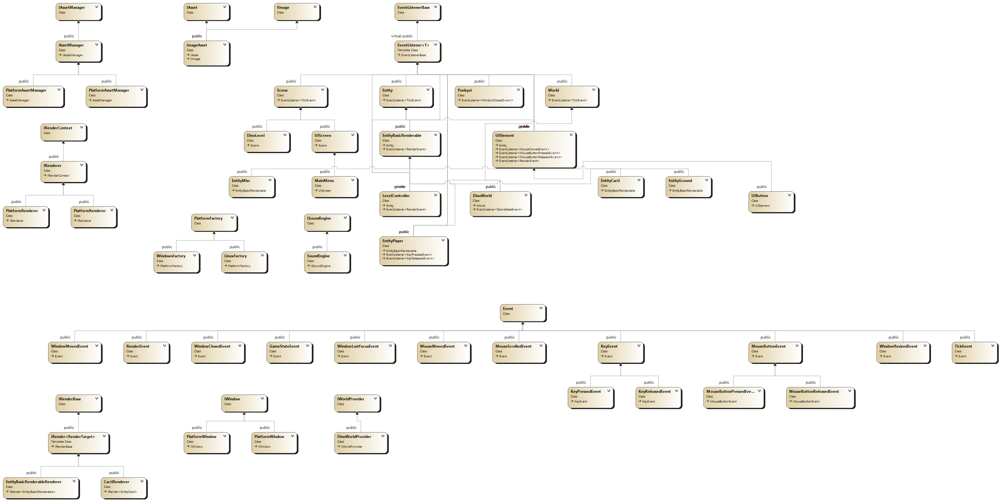
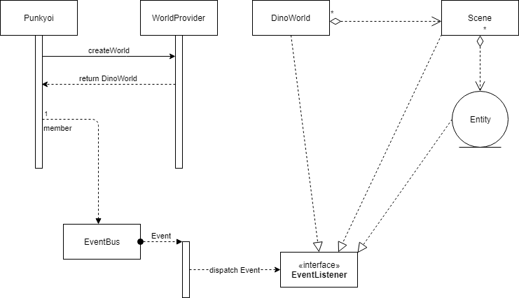

# Punkyoi
Punkyoi is a 2D runner game inspired by the Chrome's Dino game.

#### Controlls:
- Jump - space
- Pull to the ground - left shift

## Used patterns
- Builder - IWorldProvider
- Factory - PlatformFactory
- Singletone - Punkyoi
- Observer - Entity, EventListener
- Adaptor AssetManager
- CoR - EventListener + EventBus
- Command - Event

# UML Diagrams
## Basic

## Extended

## Class interaction

# Build instructions
- CMake build target `punkyoiBundle`.
- **Windows installation wizard:**
    Installation wizard at [GitHub Releases](https://github.com/CreoDen-dev/punkyoi/releases/tag/v1.0.0). Runs as normal windows setup, requires Punkyoi.msi.